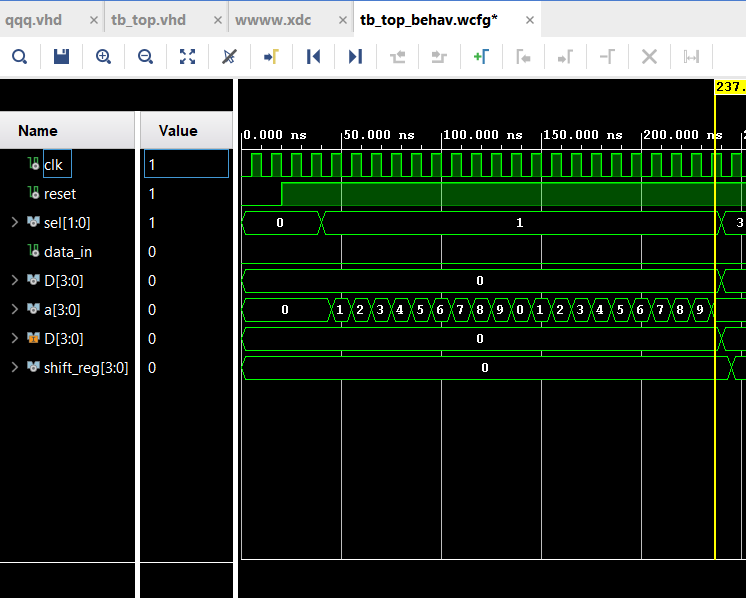
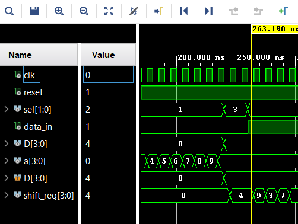
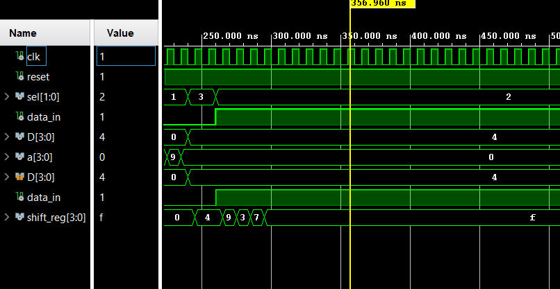

# 4-bit BCD Counter & Shift Register – FPGA (VHDL)

Academic project

Implemented a 4-bit BCD up-counter, shift and parallel register in VHDL, deployed on a BASYS3 FPGA board.

Features:
- Active-low reset
- Mode selection (counter / shift / parallel load)
- 7-segment display driver
- LED visualization
- Fully synthesized and implemented in Vivado

Demonstrates practical FPGA design, sequential logic, and hardware verification workflow.

## Simulation Results

The design was functionally verified using Vivado Simulator before hardware deployment.

### BCD Counter Verification

The waveform confirms:
- Correct counting sequence (0 → 9)
- Automatic reset after 9
- Proper synchronization on rising clock edge

### Parallel Load Verification

The simulation confirms that when `sel = 11`, the input vector `D` is correctly loaded into the shift register.

### Shift Register Verification

The waveform shows correct serial shifting behavior on each clock cycle when `sel = 10`.

